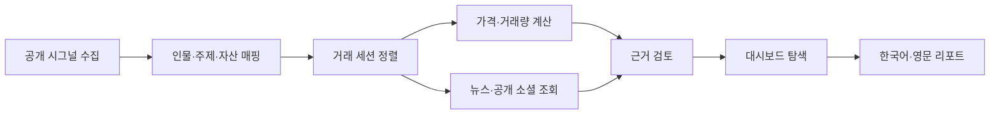
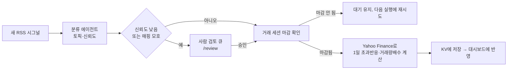

# 📈 Market Signal Atlas

### Public Signal Intelligence Dashboard for Market, News, and Social Reactions

> 공개 발언·뉴스·공시·청문회가 등장한 시점에 시장 가격, 뉴스량, 공개 소셜 관심도가 어떻게 함께 관찰됐는지 탐색하는 이벤트 인텔리전스 대시보드

---

## Overview

본 프로젝트는 OpenAI 해커톤에서 제작한 이벤트 기반 시장 시그널 탐색 서비스입니다. 공개 발언이나 뉴스가 나온 시점에 특정 자산의 가격, 거래량, 뉴스 보도량, 공개 소셜 관심도가 어떤 형태로 함께 움직였는지 한 화면에서 확인할 수 있도록 설계했습니다.


단순히 “누가 말해서 가격이 올랐다”는 결론을 제시하는 데서 끝나지 않고,

- 원문 발언과 출처 URL
- 실제 거래 세션 기준 가격 반응
- SPY, QQQ, BTC-USD 같은 시장 기준 자산
- 뉴스량과 공개 소셜 검색 표본
- Direct, Policy, Proxy 연결 구분
- 신뢰도와 해석 한계

를 함께 고려하여,

> “시장 움직임 근처에는 어떤 공개 정보와 근거가 있었는가?”

를 사용자가 직접 추적할 수 있게 만드는 것을 목표로 했습니다.

---

## Demo

- 배포 화면: https://market-mover.vercel.app/
- 한국어 화면: https://market-mover.vercel.app/ko
- 최신 작업본(폰트·색상·차트 UI 개편 + 실시간 반응 파이프라인 포함): https://market-mover-sigma.vercel.app/ko
- 자세한 심사/시연 동선: [docs/DEMO_GUIDE.md](docs/DEMO_GUIDE.md)

로그인, 결제, 개인 API 키 입력 없이 바로 사용할 수 있습니다.

---

## 3-Minute Review Path

심사위원이나 처음 보는 사용자는 아래 순서로 핵심 기능을 빠르게 확인할 수 있습니다.

### 1️⃣ 시장 움직임에서 시작하기

첫 화면에서 `시장 타임라인 보기`를 누른 뒤 `SPY`, `QQQ`, `BTC-USD` 중 하나를 선택합니다. 기간을 `최근 60 / 120 / 250 거래 세션` 중에서 선택하면 실제 종가 위에 사건 마커가 표시됩니다.

| 마커 | 의미 |
| --- | --- |
| `Direct` | 인물·기업과 자산의 직접 연결 |
| `Policy` | 정책·거시 발언과 시장 연결 |
| `Proxy` | 직접 상장사가 없어 산업·ETF·협력사를 프록시로 연결 |

마커를 누르면 해당 거래 세션의 대표 시그널이 선택되고 `시그널 탐색` 상세로 이동합니다. 마커는 인과관계가 아니라 같은 시점에 관찰된 공개 정보입니다.

### 2️⃣ 재현 가능한 대표 사례 보기

`시그널 탐색`에서 아래 조건을 선택하면 대표적인 Musk-Tesla 사례를 빠르게 볼 수 있습니다.

```text
인물       Elon Musk
주제       Tesla & EV
연결 유형  Direct
정렬       1일 초과반응순
```

목록 첫 행과 중앙의 `선택 사건`이 아래 사례를 가리키는지 확인합니다.

```text
Elon Musk · TSLA · 2024-10-25
1일 초과반응 +21.11%
```

이 화면에서 원문, 출처 URL, 게시 시각, 장전·장중·장후 구분, 거래 세션 정렬, 거래량 배수와 3일 지속성을 함께 확인할 수 있습니다.

### 3️⃣ 한 사건에서 여러 자산 비교하기

선택 사건의 차트에서 다음 두 보기를 전환합니다.

* `동시 반응 비교`: 발언 직전 종가를 `0%`로 맞추고 주요 연결 자산, SPY, QQQ, BTC-USD를 같은 축에서 비교
* `실제 종가`: 선택 자산의 실제 달러 종가를 D-5부터 D+5까지 확인

차트의 세로선에는 원 게시 시각(ET)과 장 상태가 표시됩니다. 일봉 데이터로 게시 순간의 가격을 추정하지 않고, 실제 거래 세션 종가와 정확한 게시 시각을 분리합니다.

### 4️⃣ 가격 이외의 반응 확인하기

차트 위 반응 렌즈를 전환하면 `시장`, `뉴스`, `대중 관심`을 분리해서 확인할 수 있습니다. 뉴스 화면에는 검색 쿼리, 반환 구간, 기사 링크와 공급자가 표시됩니다. 대중 관심은 Bluesky 공개 검색의 최대 100개 표본이며 X 전체 언급량으로 표현하지 않습니다.

### 5️⃣ 결론보다 근거 먼저 확인하기

우측 또는 모바일 상세 아래의 `근거 검토`에서 판정, 신뢰도, 핵심 한계를 먼저 확인합니다. `검토 과정 보기`를 누르면 시그널 분류, 자산 매핑, 뉴스·소셜 확산 점검, 시장 반응 계산, 신뢰도 감사, 한국어·영문 리포트 단계를 확인할 수 있습니다.

---

## Key Features

- 시장 타임라인에서 가격 움직임과 같은 세션의 공개 시그널 역탐색
- 사건별 연결 자산, SPY, QQQ, BTC-USD 동시 반응 비교
- 실제 종가 기준 D-5부터 D+5까지 가격창 시각화
- 뉴스량, 공개 소셜 표본, 시장 반응 렌즈 전환
- Direct, Policy, Proxy 연결 유형 분리
- 게시 시각, 장전·장중·장후, 다음 거래 세션 정렬 표시
- 결정론적 근거 검토와 선택형 OpenAI 보조 리포트 분리
- 전체 원문 카탈로그와 군집 대표 검색 UI 제공
- 한국어/영문 UI 및 모바일 반응형 대시보드 제공
- (선택, KV 연동 시) 최신 시그널의 "대기" 상태를 분류 에이전트 + 세션 마감 확인으로 자동 해소하고, 애매한 케이스만 `/review`에서 사람이 승인/반려

---

## Tech Stack

### 프레임워크와 언어

<p>
  
  
  
</p>

### 시각화와 UI

<p>
  
  
  
</p>

### 데이터와 자동화

<p>
  
  
  
  
  
</p>

### 테스트와 배포

<p>
  
  
  
</p>

---

## Analysis Framework

### 1️⃣ 공개 시그널 수집

공개 발언, 뉴스, 공시, 청문회 사례를 `Signal` 단위로 표준화했습니다.

* 원문 텍스트
* 출처 URL
* 게시 또는 보도 시각
* 인물, 주제, 연결 자산
* 정확한 시각/날짜 단위 시간 정밀도

### 2️⃣ 시장 거래 세션 정렬

사건 시각을 미국 거래 세션 기준으로 정렬했습니다.

* 장전, 장중, 장후 구분
* 주말과 휴일은 다음 거래 세션으로 이동
* 일봉 가격에서 게시 순간의 가격을 추정하지 않음
* 연결 자산과 시장 기준 자산을 함께 비교

### 3️⃣ 다중 출처 반응 확인

가격 반응만 보지 않고 뉴스와 공개 소셜 표본을 함께 확인했습니다.

* 1일 초과수익률
* 거래량 배수
* 3일 지속성
* 뉴스 검색 결과 수
* 공개 소셜 게시물·해시태그 표본

### 4️⃣ 근거 검토

모델이 결론을 만들어내는 방식이 아니라, 실제 관측값과 규칙 기반 감사 항목을 먼저 보여주도록 구성했습니다.

* 연결 유형 검토
* 출처와 시각 정밀도 확인
* 결측, 오래된 데이터, 대체 데이터 상태 표시
* 선택형 OpenAI 보조 리포트는 서버에서만 실행

---

## Key Metrics

### 1일 초과수익률

```text
연결 자산의 1일 수익률 - 비교 기준 자산의 1일 수익률
```

### 거래량 배수

```text
이벤트 거래 세션 거래량 / 직전 20거래일 평균 거래량
```

### 3거래일 지속성

3거래일 누적 초과수익률을 `Persisted`, `Faded`, `Reversed`로 구분합니다.

불투명한 단일 영향 점수는 사용하지 않습니다. 사용자는 1일 초과반응, 거래량, 3일 지속성, 최신순 중 정렬 기준을 직접 선택합니다.

---

## Time Alignment Principles

- 정확한 게시 시각은 미국 동부시간(ET)으로 표시합니다.
- 장 마감 후, 주말, 휴일 발언은 다음 미국 거래 세션에 정렬합니다.
- 날짜만 확인되는 출처는 `날짜 단위`로 표시합니다.
- 일봉에서는 게시 순간의 가격을 추정하지 않습니다.
- BTC-USD는 현재 주식 거래 세션 날짜에 표본화된 비교 맥락이며 완전한 24/7 분봉 분석이 아닙니다.

---

## Workflow



---

## Key Findings

* 가격 움직임만으로 원인을 단정하기보다, 같은 거래 세션의 공개 시그널을 함께 놓고 검토하는 방식이 더 투명함
* Direct, Policy, Proxy 연결을 분리하면 “직접 연결된 기업”과 “시장 전체 맥락”을 구분할 수 있음
* 한 사건은 단일 자산보다 SPY, QQQ, BTC-USD 같은 기준 자산과 함께 볼 때 해석 한계가 더 잘 드러남
* 뉴스량과 공개 소셜 관심도는 가격 반응과 같은 방향으로 움직이지 않을 수 있으므로 별도 렌즈가 필요함
* AI 리포트는 결론 생성기가 아니라 이미 계산된 근거를 설명하는 보조 레이어로 두는 편이 안전함

---

## Data Scope

```text
원본 데이터 145,442행
→ 조건을 통과한 원문 32,393개
→ 군집 대표 1,162개
→ 근거 준비 SNS 시그널 735개
→ 뉴스 7개 + 공시 1개 + 청문회 1개
→ 메인 아틀라스 총 744개
```

| 구분 | 현재 범위 |
| --- | --- |
| 인물 | Donald Trump, Elon Musk, Sam Altman 검토 사례 |
| 원문 출처 | Social, News, Filing, Hearing |
| 자산 | SPY, QQQ, TSLA, NVDA, MSFT, SOXX, BTC-USD |
| 시장 기준 | 모든 사건에 SPY, QQQ, BTC-USD 제공 |
| 가격 데이터 | 이벤트 D-5부터 D+5까지 일봉 종가와 거래량 |
| 최신 발언 | 독립 공개 아카이브의 Trump RSS, 하루 캐시 |
| 뉴스 | Google News RSS, GDELT 보조, 검토 스냅샷 대체 데이터 |
| 공개 소셜 | Bluesky 공개 검색 표본, 로컬 추적 코퍼스 대체 데이터 |

---

## Data and AI Separation

기본 배포 환경은 결정론적 근거 검토를 사용합니다.

| 단계 | 처리 방식 |
| --- | --- |
| 가격·거래량·수익률 | 실제 데이터와 고정 수식 |
| 토픽·자산 후보 | 검토 데이터 + 공개된 규칙 |
| 뉴스·소셜 | 외부 공개 검색 또는 명시된 대체 데이터 |
| 신뢰도 | 출처·시간 정밀도·직접/프록시·결측 규칙 |
| 리포트 | 기본은 결정론적, OpenAI는 서버에서 명시적으로 활성화할 때만 보조 |

OpenAI 보조 경로가 실패하거나 비활성화되어도 가격 계산과 근거 화면은 그대로 동작합니다. API 키는 브라우저에 노출하지 않습니다.

---

## Live Reaction Pipeline (optional, requires KV)

`KV_REST_API_URL` / `KV_REST_API_TOKEN`(Vercel Marketplace의 Upstash Redis 연동)이 설정되면, 최신 Trump RSS 시그널이 "대기" 상태에 머무르지 않고 자동으로 반응 지표를 계산합니다.



- **분류 에이전트**: `ENABLE_LIVE_AI=true` + `OPENAI_API_KEY`가 있으면 단일 OpenAI 호출로 토픽·신뢰도를 판단합니다. 없으면 기존 규칙 기반 토픽 분류로 대체됩니다(`src/lib/liveReaction.ts`).
- **사람 개입(HITL)**: confidence가 Low이거나 자산 매핑이 간접(Proxy)인 경우에만 `/review` 페이지의 검토 큐로 보내고, 나머지는 자동 진행합니다. 사람은 애매한 케이스만 봅니다.
- **가격 계산**: 정렬된 거래 세션이 실제로 마감된 뒤에만 Yahoo Finance 일봉으로 1일 초과수익률·거래량배수를 계산합니다(기존 오프라인 빌드 파이프라인과 동일한 수식). 세션이 아직 안 끝났으면 계속 "대기" 상태를 유지하다가 다음 실행(`/api/live` 호출 또는 하루 1회 cron)에서 재시도합니다.
- KV가 설정되어 있지 않으면 이 파이프라인은 조용히 비활성화되고, 기존처럼 "시장 반응 계산 대기" 문구만 표시됩니다 — 즉 선택적 기능이며 기본 배포를 깨뜨리지 않습니다.
- 여기서 계산된 값은 메인 744건 아틀라스 데이터셋에는 포함되지 않습니다(그건 여전히 `npm run data:build` 오프라인 파이프라인으로 관리). 최신 시그널 카드 하나에만 반영되는 경량 보조 기능입니다.

---

## Repository Structure

Next.js 앱은 레포지토리 루트에서 바로 실행됩니다. 
```bash
.
├── README.md                   # 프로젝트 소개와 실행 안내
├── package.json                # 실행 스크립트, 의존성, PostCSS 설정
├── package-lock.json           # npm 의존성 잠금 파일
├── next.config.ts              # Next.js 설정
├── tsconfig.json               # TypeScript와 @ alias 설정
├── vercel.json                 # Vercel Cron 설정
├── .vercelignore               # Vercel 배포 제외 규칙
├── .gitignore                  # 로컬 캐시, 빌드 결과, 작업 로그 제외
│
├── config/                     # 루트에 없어도 되는 보조 설정
│   ├── env.example             # 환경 변수 예시
│   ├── eslint.config.mjs       # ESLint 설정
│   └── vitest.config.ts        # Vitest 설정
│
├── src/                        # 애플리케이션 소스 코드
│   ├── app/                    # Next.js App Router
│   │   ├── api/                # live, news, research, signals, cron, review API
│   │   ├── ko/                 # 한국어 페이지 라우트
│   │   ├── layout.tsx
│   │   └── page.tsx
│   ├── components/             # 대시보드 UI 컴포넌트
│   └── lib/                    # 데이터 로딩, 지표 계산, 근거 오케스트레이션
│
├── data/                       # 앱에서 읽는 데이터셋
│   ├── raw/                    # Trump·Musk 원본 CSV
│   ├── source/                 # 검토 사건, 뉴스 스냅샷, 한국어 요약 JSON
│   └── generated/              # 화면/API가 읽는 배포용 JSON
│
├── scripts/                    # 데이터셋 빌드와 AI 배치 유틸리티
│
└── docs/                       # 심사/시연 문서와 제작 기록
    ├── DEMO_GUIDE.md           # 3분 체험 경로
    ├── images/                 # README·데모용 이미지
    ├── presentation/           # 발표 자료
    ├── project-notes/          # 구현 로그, 리디자인 메모, UI/UX 피드백
    └── ui-audit/               # 화면 검수 이미지
```

로컬 실행, 테스트, 빌드는 모두 레포지토리 루트에서 바로 진행합니다.

---

## API Routes

| 경로 | 역할 |
| --- | --- |
| `GET /api/live` | 최신 RSS와 시장 스냅샷 |
| `GET /api/signals` | 전체 원문, 군집, 근거 레이어 검색 |
| `GET /api/news?eventId=...` | 선택 사건의 뉴스와 공개 소셜 근거 |
| `POST /api/research` | 결정론적 근거 검토와 선택형 AI 보조 리포트 |
| `GET /api/cron/refresh` | 인증된 일일 upstream 캐시 갱신 |

---

## Review Checklist

- [x] 실제 공개 원문과 출처 URL
- [x] 실제 시장 종가·거래량
- [x] 시장 움직임 → 공개 시그널 역탐색
- [x] 사건별 다중 자산 비교
- [x] 뉴스·해시태그·공개 게시물 근거
- [x] Direct / Policy / Proxy 구분
- [x] 정확한 시각/날짜 단위 및 장전·장중·장후 구분
- [x] 한국어·영문 UI
- [x] 규칙 기반 계산과 선택형 AI 보조 분리
- [x] 결측·오래된 데이터·대체 데이터 표시
- [x] 모바일 390px 가로 넘침 방지
- [x] GitHub·Vercel·자동 테스트

---

## Local Development

```bash
npm install
npm run dev
```

로컬 실행:

- 기본 화면: http://localhost:3000
- 한국어 화면: http://localhost:3000/ko

검증:

```bash
npm run lint
npm test
npm run build
```

---

## Environment Variables

`config/env.example`을 `.env.local`로 복사하고 필요한 값만 설정합니다.

```env
TWELVE_DATA_API_KEY=
CRON_SECRET=

# 선택 사항: 서버 전용 AI 리포트 보조 기능
OPENAI_API_KEY=
OPENAI_MODEL=gpt-5.4-nano
ENABLE_LIVE_AI=false
```

`OPENAI_API_KEY`는 서버에서만 사용하며 브라우저에 노출하지 않습니다. 공개 사용자는 자신의 API 키를 입력하지 않습니다.

---

## Current Limitations

- 발언과 시장 반응의 시간적 연관성은 인과관계 증명이 아님
- 무료 데모에는 X 전체 아카이브나 실시간 전체 스트림이 없음
- Musk·Altman의 최신 X 게시물은 실시간 추적하지 않음
- 공개 소셜 수치는 Bluesky 검색 표본 또는 로컬 추적 코퍼스 범위임
- 미국 주식 과거 반응은 일봉 기준이며 분 단위 가격 분석이 아님
- BTC-USD는 아직 별도의 24/7 시간봉 세션 모델을 사용하지 않음
- 로그인, 알림, 결제, 데이터베이스는 해커톤 MVP 범위에서 제외함

---

## Conclusion

Market Signal Atlas는 공개 정보와 시장 반응을 하나의 증거 경로로 연결하는 대시보드입니다.

이 프로젝트는 특정 발언이 가격을 움직였다고 단정하지 않고, 원문, 거래 세션, 가격·거래량, 뉴스량, 공개 소셜 표본, 신뢰도 한계를 함께 보여줍니다. 사용자는 시장 움직임에서 출발해 같은 시점의 공개 시그널을 역탐색하거나, 하나의 사건을 여러 자산과 비교하며 근거를 검토할 수 있습니다.

따라서 목표는 가격 예측이 아니라, 시장 해석 과정에서 근거와 한계를 더 투명하게 만드는 것입니다.

---

## Notice

Market Signal Atlas는 연구와 모니터링을 위한 도구입니다. 투자 조언, 매수·매도 추천, 가격 예측 서비스가 아닙니다.
